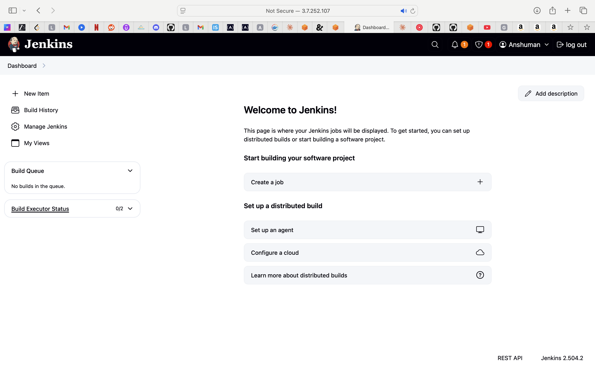
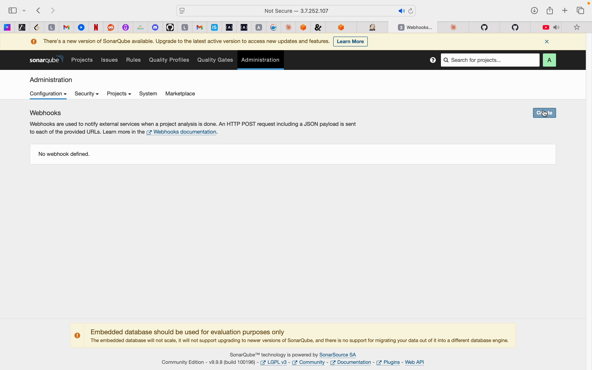
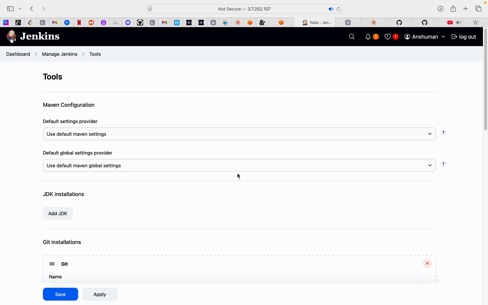
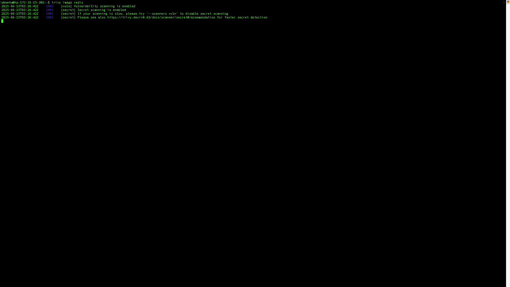

# DevSecOps Setup and Integration

This repository showcases my work on setting up and integrating various DevSecOps tools including Jenkins, SonarQube, and OWASP.

## Overview

This project demonstrates the implementation of a complete DevSecOps pipeline with the following components:

- Jenkins CI/CD setup
- SonarQube integration for code quality and security scanning
- OWASP ZAP for security testing
- Integration between Jenkins and SonarQube

## Components

### Jenkins Setup

Jenkins is configured to automate the build, test, and deployment processes.

### SonarQube Integration

SonarQube is integrated with Jenkins to provide continuous code quality and security scanning.

### OWASP ZAP Setup

OWASP ZAP is used for security testing and vulnerability scanning.

### Image Scanning with SonarQube

Demonstrates container image scanning capabilities using SonarQube.

## Installation and Setup

Detailed setup instructions for each component:

### Jenkins Setup
1. Install Jenkins using Docker or direct installation
2. Configure Jenkins with necessary plugins
3. Set up build jobs and pipelines

### SonarQube Setup
1. Install SonarQube server
2. Configure quality gates and rules
3. Integrate with Jenkins using plugins

### OWASP ZAP Setup
1. Install OWASP ZAP
2. Configure security scanning profiles
3. Integrate with CI/CD pipeline

## Demo Videos

Demo videos showcasing the setup and integration process are available upon request.

## Benefits

- Automated security scanning integrated into CI/CD pipeline
- Early detection of vulnerabilities and code quality issues
- Consistent security practices throughout the development lifecycle
- Improved code quality and reduced security risks

## Future Improvements

- Add Terraform for infrastructure as code
- Implement Kubernetes deployment
- Add more security scanning tools
